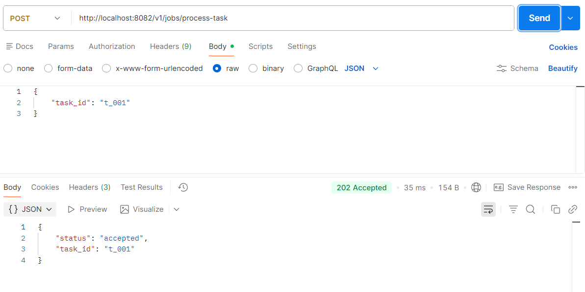
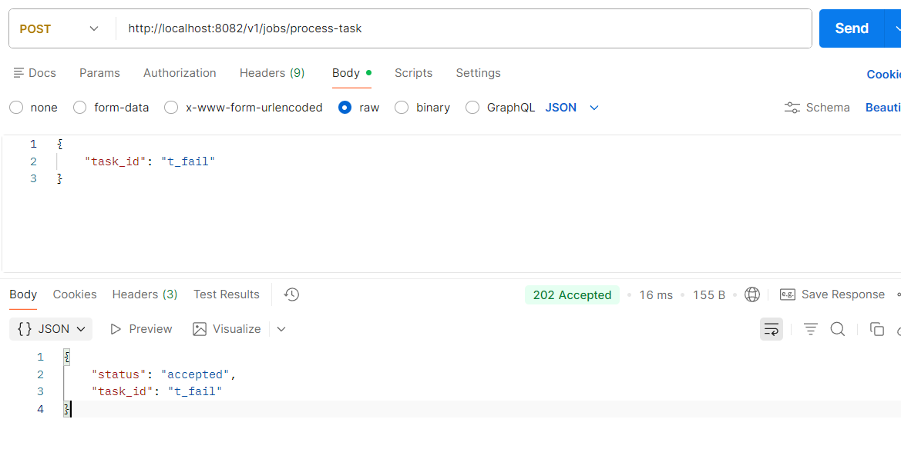
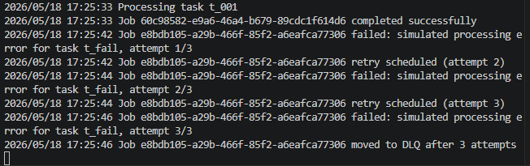
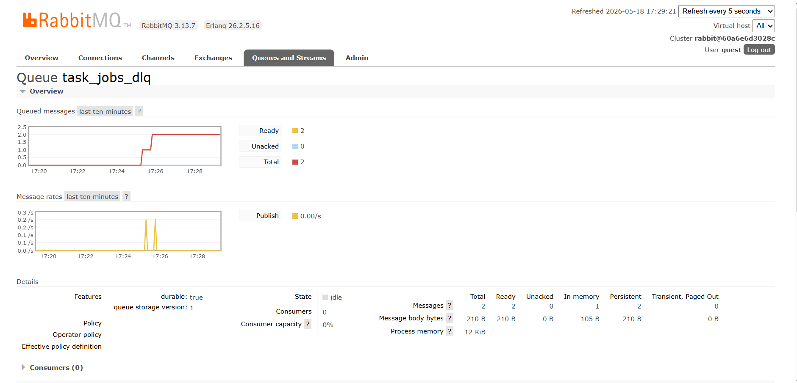

# Практическое занятие №14
# Реализация очереди задач (producer-consumer)

**Дисциплина:** Технологии индустриального программирования  
**Семестр:** 2, 2025-2026  
**Студент:** Синицын А.Г. ЭФМО-01-25

---

## Краткое описание проекта

На основе RabbitMQ реализована очередь задач с поддержкой повторных попыток (retry), очереди недоставленных сообщений (DLQ) и идемпотентной обработки.  
Producer (HTTP-сервис) ставит задачу в очередь `task_jobs`. Worker читает задачи, имитирует обработку (успех или ошибка), при ошибке увеличивает счётчик попыток и переотправляет задачу. После 3 неудачных попыток задача попадает в DLQ `task_jobs_dlq`.  
Идемпотентность обеспечивается уникальным `message_id` и хранением обработанных ID в памяти worker'а.

---

## Структура проекта

```
pz14-job-queue/
├── deploy/
│   └── rabbit/
│       └── docker-compose.yml
├── services/
│   ├── tasks/
│   │   ├── cmd/tasks/main.go
│   │   ├── internal/jobs/task_job.go
│   │   └── go.mod
│   └── worker/
│       ├── cmd/worker/main.go
│       ├── internal/jobs/task_job.go
│       ├── internal/store/processed.go
│       └── go.mod
└── README.md
```

---

## Требования к проекту

- Go 1.21+
- Docker / Docker Compose
- RabbitMQ 3

---

## Запуск

### 1. Запустить RabbitMQ
```
cd deploy/rabbit
docker compose up -d
```

### 2. Запустить worker
```
cd services/worker
go run ./cmd/worker
```

### 3. Запустить сервис tasks
```
cd services/tasks
go run ./cmd/tasks
```

---

## Тестирование через Postman (или curl)

### 4.1 Успешная задача
**POST** `http://localhost:8082/v1/jobs/process-task`  
Body:
```
{
    "task_id": "t_001"
}
```
Ответ: `202 Accepted`. В логе worker: `Job ... completed successfully`.

### 4.2 Задача с ошибкой (retry и DLQ)
**POST** с `"task_id": "t_fail"`.  
Worker совершит 3 попытки, затем переместит задачу в DLQ.

### 4.3 Проверка DLQ
Открыть RabbitMQ Management UI: `http://localhost:15672` (guest/guest). Очередь `task_jobs_dlq` содержит сообщения, не обработанные после 3 попыток.

---

## Результаты выполнения (скриншоты)

### Постановка обычной задачи (успешная обработка)


### Проверка retries и DLQ (задача с ошибкой)


### Логи worker


### Проверка DLQ через RabbitMQ Management UI


---

## Ответы на контрольные вопросы

**1. Чем задача в очереди отличается от простого события?**  
Событие – короткое уведомление о факте (например, «задача создана»). Задача – это работа, которая может обрабатываться долго, может завершиться ошибкой и требовать повторных попыток.

**2. Зачем нужны retries?**  
Повторные попытки нужны для обработки временных ошибок (например, недоступность внешнего сервиса). Они позволяют системе восстановиться без потери сообщения.

**3. Почему нельзя бесконечно возвращать ошибочное сообщение в основную очередь?**  
Бесконечные повторы приведут к зацикливанию и блокировке очереди, а также создадут бесконечную нагрузку на систему.

**4. Что такое DLQ и зачем она используется?**  
DLQ (Dead Letter Queue) – очередь, куда попадают сообщения, которые не удалось обработать после всех попыток. Она предотвращает потерю данных и позволяет анализировать проблемные сообщения.

**5. Почему в системах очередей возможна повторная доставка одного и того же сообщения?**  
Из-за модели at-least-once delivery: если worker обработал сообщение, но не успел отправить ack до сбоя, брокер переотправит сообщение.

**6. Что такое идемпотентность обработчика?**  
Обработчик идемпотентен, если повторное выполнение одной и той же операции не приводит к изменению состояния системы (или результат такой же, как при первом вызове).

**7. Зачем нужен message_id?**  
Для уникальной идентификации сообщения – позволяет отличить повторную доставку от нового сообщения и реализовать идемпотентность.

**8. Почему хранение обработанных message_id даже в памяти полезно для учебного примера?**  
Простота реализации и наглядность. Даже при перезапуске worker'а учебный пример не требует персистентного хранилища, но идея демонстрируется.

**9. Что произойдёт, если worker выполнит обработку, но не успеет отправить ack?**  
RabbitMQ не получит подтверждения и переотправит сообщение (возможно, другому consumer). Это может привести к дублированию обработки.

**10. Почему модель producer-consumer удобна для тяжёлых фоновых задач?**  
HTTP-запрос не блокируется на время тяжёлой обработки; клиент получает быстрый ответ; обработка масштабируется отдельно; система становится более отказоустойчивой.
